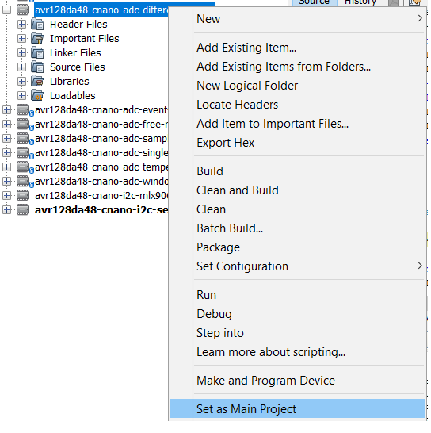
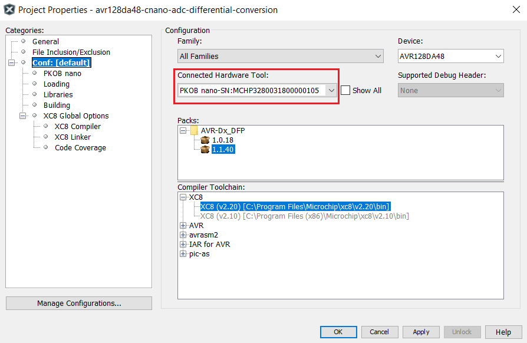
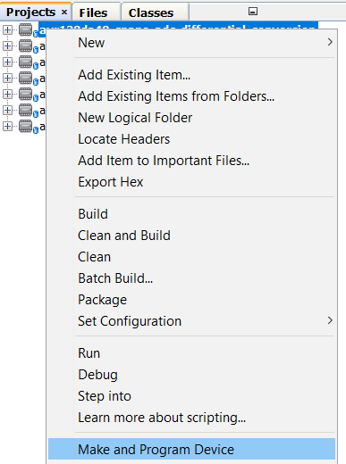
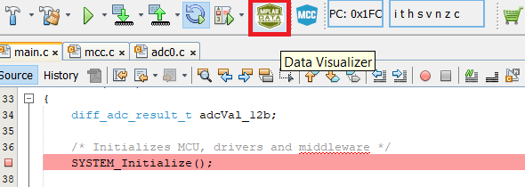
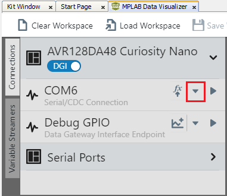
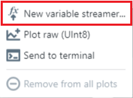
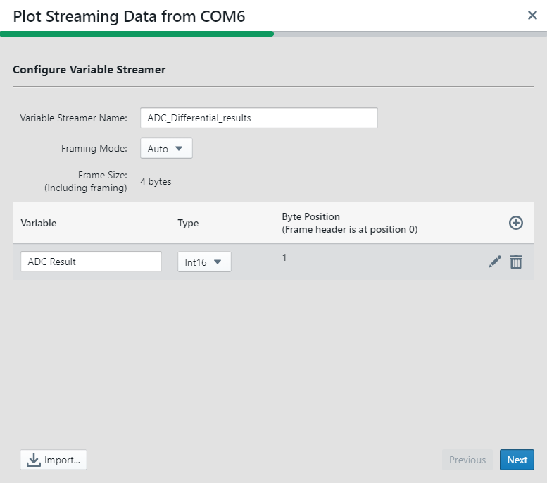
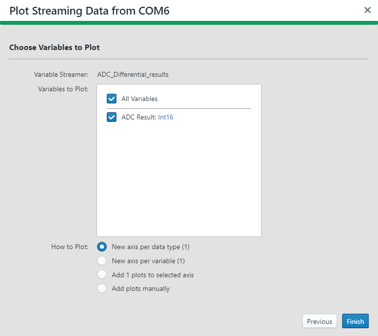
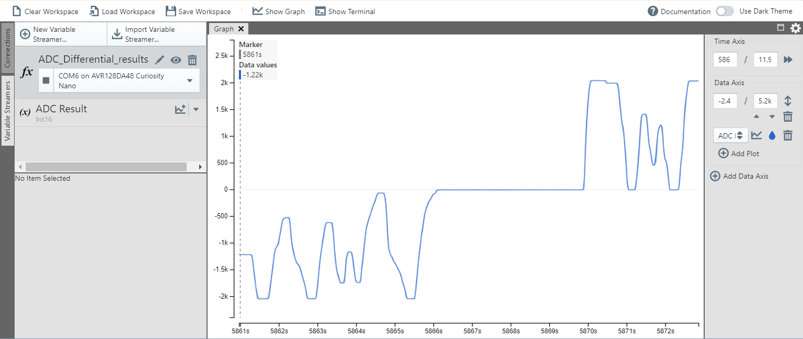

# AVR128DA48 ADC Differential Conversion

## Objective

In this application, the ADC is configured to convert data from a differential input. The code will be generated using the MPLAB Code Configurator. The ADC results will be transmitted through USART and plotted using the Data Visualizer plugin.

## Related Documentation

- [Differential ADC Using the AVR128DA48 Curiosity Nano](http://ww1.microchip.com/downloads/en/DeviceDoc/AVR-DA-Training-Manual-Differential-ADC-Using-the-AVR128DA48-Curiosity-Nano-DS40002244A.pdf)
- [AVR128DA48 Product Family Page](https://www.microchip.com/design-centers/8-bit/avr-mcus/device-selection/avr-da)
- [AVR128DA48 Data Sheet](http://ww1.microchip.com/downloads/en/DeviceDoc/40002183A.pdf)

## Software Used

- MPLAB® X IDE 5.40 or newer [(microchip.com/mplab/mplab-x-ide)](http://www.microchip.com/mplab/mplab-x-ide)
- MPLAB® XC8 2.20 or newer compiler [(microchip.com/mplab/compilers)](http://www.microchip.com/mplab/compilers)
- MPLAB® Data Visualizer plugin 1.1 

## Hardware Used

- AVR128DA48 Curiosity Nano [(DM164151)](https://www.microchip.com/DevelopmentTools/ProductDetails/PartNO/DM164151)
- Curiosity Nano Base for Click boards™ [(AC164162)](https://www.microchip.com/developmenttools/ProductDetails/AC164162)
- Two POT Click boards

## Setup

The AVR128DA48 Curiosity Nano Development Board is used as the test platform. To integrate the POT Click boards, the Curiosity Nano Base for Click boards is used.

 The following configurations must be made:

|Pin           | Configuration      |
| :----------: | :----------------: |
|PD3 (AIN3)    | Analog Input       |
|PD4 (AIN4)    | Analog Input       |
|PC0 (TX)      | Digital Output     |

## Operation

1. Connect the board to the PC.

2. Open the *avr128da48-cnano-adc-differential-mcc.X* project in MPLAB® X IDE.

3. Set *avr128da48-cnano-adc-differential-mcc.X* project as main project. Right click on the project in the *Projects* tab and click *Set as Main Project*:

 

4. Select the AVR128DA48 Curiosity Nano in the *Connected Hardware Tool* drop down list of the project settings:
  - Right click on the project and click *Properties*;
  - Select the AVR128DA48 Curiosity Nano (click on the SN) in the *Connected Hardware Tool* list and then click *OK*:

 

5. Program the project to the board: right click on the project and click *Make and Program Device*:

 

6. Open the Data Visualizer
 
   - From the Curiosity Nano COMn port, open the drop down list:
 
   - From the drop down list, select New variable streamer...:
 
   - Configure the Variable Streamer Name and add the desired variable, then click Next:
 
   - Select all the variables to plot, select New axis per data type, and click Finish:
 

Result:
Rotating the Potentiometers on the POT click boards (after starting the application), the ADC result will be plotted on the graph:

## Summary 

This application showcases the differential-conversion feature of the AVR-DA ADC. 
